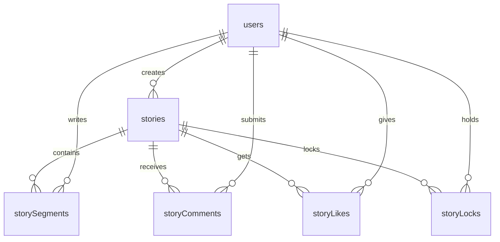

# Story Weaver - Feature Documentation

## Core Features Deep Dive

### 🎭 Cast Action System

**Purpose**: Transform any Farcaster cast into a collaborative storytelling seed
**Location**: `server/routes.ts:714` (POST `/api/cast-actions/weave-story`)

**How It Works**:
1. User clicks "Weave My Part" action on any cast in Farcaster
2. Farcaster sends POST request with cast context to our handler
3. System creates new collaborative story using the cast as initial content
4. Returns frame response that posts a weaved cast back to Farcaster

**Request Format** (Farcaster Action Spec):
```json
{
  "untrustedData": {
    "fid": 123456,
    "timestamp": 1699999999,
    "castId": {
      "hash": "0xabc123...",
      "fid": 789012
    }
  },
  "trustedData": {
    "messageBytes": "..."
  }
}
```

**Response Format** (Frame Response):
```json
{
  "type": "frame",
  "frameUrl": "https://worthifyme.in/story/uuid",
  "cast": {
    "text": "🧙‍♂️ Story Weaver: New collaborative story started!...",
    "embeds": ["https://worthifyme.in/story/uuid"],
    "parent": "0xoriginal_cast_hash"
  }
}
```

### 👍 Like-Based Permission System

**Purpose**: Social proof mechanism that grants commenting privileges
**Location**: `server/routes.ts:350` (POST `/api/stories/:id/like`)

**Permission Flow**:
- **View**: Anyone can read stories
- **Like**: Anyone can like/unlike stories
- **Comment**: Must like story first to unlock commenting
- **Incorporate**: Only story creator can approve comments

**Database Design**:
```sql
-- Tracks user likes and enables permission checks
CREATE TABLE story_likes (
  id VARCHAR PRIMARY KEY,
  story_id VARCHAR NOT NULL,
  user_fid INTEGER NOT NULL,
  cast_hash TEXT,
  created_at TIMESTAMP DEFAULT CURRENT_TIMESTAMP
);
```

### ✍️ Collaborative Writing Workflow

**Purpose**: Curated collaboration where creators control story quality
**Components**: Comments → Approval → Segments

**Process Flow**:
1. **Comment Submission** (`POST /api/stories/:id/comments`)
   - User must have liked the story
   - Submits story continuation as comment
   - Goes into pending state

2. **Creator Review** (UI in `client/src/pages/story.tsx`)
   - Story creator sees pending comments
   - Can approve or decline each comment
   - Approved comments become story segments

3. **Incorporation** (`POST /api/stories/:id/comments/:commentId/incorporate`)
   - Moves comment content to story segments
   - Maintains order with `orderIndex`
   - Deletes original comment

### 🔒 Writing Lock System

**Purpose**: Prevent simultaneous editing conflicts
**Location**: `server/routes.ts:236` (POST `/api/stories/:id/lock`)

**Lock Mechanism**:
- **Duration**: 1 minute maximum
- **Scope**: Per story (only one user can write at a time)
- **Auto-release**: Expires after timeout or manual release
- **Permission**: Must have liked the story

**Use Cases**:
- Creator incorporating comments
- Long-form story writing
- Preventing lost work from concurrent edits

### 🎯 Farcaster SDK Integration

**Purpose**: Seamless user authentication and social features
**Location**: `client/src/hooks/use-farcaster.tsx`

**Features**:
- **Authentication**: No passwords, uses Farcaster identity
- **User Context**: FID, username, display name, profile picture
- **Cast Sharing**: Direct posting back to Farcaster
- **Enhanced Data**: Integrates with Neynar API for follower counts

**Integration Points**:
```typescript
// Auto-initialization
const { sdk, user, isLoading } = useFarcaster();

// User data flow
Farcaster SDK → Neynar API → Local Database → UI
```

### 📊 Story Structure & Metadata

**Core Story Data**:
- `originalCastHash`: Links back to seed cast
- `latestWeaveCastHash`: Tracks viral sharing chain
- `weaveCastCount`: Metrics for engagement
- `contributorCount`: Community size
- `sessionStatus`: Lifecycle management

**Content Hierarchy**:
```
Story (seed cast)
├── Initial Content (transformed cast)
├── Story Segments (approved content)
│   ├── Segment 1 (orderIndex: 1)
│   ├── Segment 2 (orderIndex: 2)
│   └── ...
└── Pending Comments (awaiting approval)
```

### 🌐 Mini App Manifest

**Purpose**: Farcaster app registration and discoverability
**Location**: `client/public/.well-known/farcaster.json`

**Key Components**:
- **Account Association**: Domain verification signature
- **Cast Actions**: Available in all cast menus
- **Triggers**: Mini app launch points
- **Meta Tags**: Social sharing optimization

## Technical Architecture

### Database Relationships



### API Request Flow

1. **Frontend** (React + TanStack Query)
   - Handles user interactions
   - Manages loading states
   - Optimistic updates

2. **Backend** (Express + Drizzle)
   - Validates requests with Zod schemas
   - Enforces permissions
   - Database operations

3. **Database** (PostgreSQL)
   - Persistent data storage
   - ACID transactions
   - Relationship integrity

### Security Model

**Authentication**:
- Farcaster SDK provides cryptographic proof of identity
- FID (Farcaster ID) is the primary user identifier
- No passwords or traditional auth required

**Authorization**:
- Story creation restricted to platform owner (FID 977521)
- Comment approval limited to story creators
- Commenting requires liking (social engagement filter)

**Data Validation**:
- Zod schemas validate all API inputs
- Drizzle ORM provides type safety
- PostgreSQL enforces referential integrity

## Deployment & Operations

### Environment Configuration

**Required Secrets**:
- `DATABASE_URL`: PostgreSQL connection string
- `FARCASTER_PRIVATE_KEY`: For signing cast actions
- `PGHOST`, `PGPORT`, `PGUSER`, `PGPASSWORD`, `PGDATABASE`: DB config

**Build Pipeline**:
1. Frontend: Vite → Static assets in `dist/public`
2. Backend: esbuild → Server bundle in `dist/index.js`
3. Deploy: Single Node.js app serves both

### Monitoring & Metrics

**Key Metrics to Track**:
- Cast action usage rates
- Story completion rates
- User engagement (likes, comments)
- Viral sharing (weave cast performance)

**Logging Strategy**:
- API request/response logging
- Farcaster action debugging
- Database operation monitoring
- Error tracking and alerting

## Future Enhancements

### Planned Features
- **Manual Approval Workflow**: Creator dashboard for comment review
- **Story Templates**: Predefined story structures
- **Collaborative Editing**: Real-time multi-user writing
- **Advanced Permissions**: Role-based access control
- **Analytics Dashboard**: Story performance metrics

### Scaling Considerations
- **Caching Layer**: Redis for hot story data
- **CDN Integration**: Static asset optimization
- **Database Optimization**: Query performance and indexing
- **Rate Limiting**: Prevent abuse and ensure fair usage